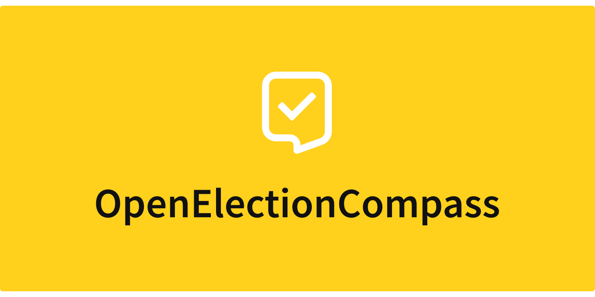

# Project state

The project is under **active development, but not production-ready** until
[v1.0](https://github.com/tillsanders/openElectionCompass/milestones) is released. You can sign up
for our [email newsletter](http://eepurl.com/gRApTD) to receive updates on new releases, upcoming
features and the community, or you can join our [Spectrum Community](https://spectrum.chat/openelectioncompass) for
technical support, questions, feature requests and chatting.

# Usage

## Deployment on your own server

Currently, it is only possible to deploy OpenElectionCompass on your own systems. However, the
process is relatively simple to be accessible for people with limited coding skills.

## Project setup
```
npm install
```

### Compiles and hot-reloads for development
```
npm run serve
```

### Compiles and minifies for production
```
npm run build
```

### Run your unit tests
```
npm run test:unit
```

### Run your end-to-end tests
```
npm run test:e2e
```

### Lints and fixes files
```
npm run lint
```

### Customize configuration
See [Configuration Reference](https://cli.vuejs.org/config/).
